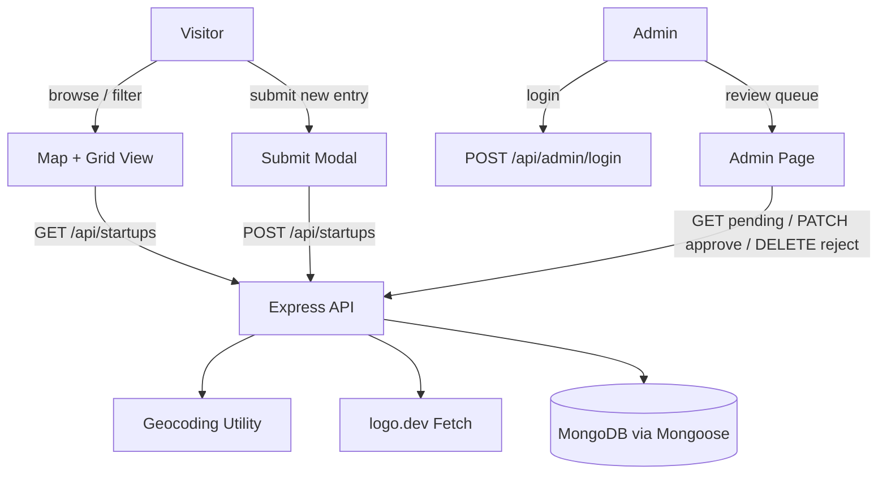

<div align="center">

# Pune Startup Tracker

**An interactive map of Pune's startup and VC ecosystem**

[](https://expressjs.com)
[](https://react.dev)
[](https://www.mongodb.com)
[](https://vitejs.dev)
[](LICENSE)

Pune Startup Tracker plots every startup and VC firm in Pune on an interactive map, lets anyone submit a new entry for review, and gives admins a simple queue to approve or reject submissions — all backed by a small, self-hosted Express + MongoDB API.

</div>

---

## What it does

Type "Pune startups" into a search engine and you get a scattered mix of blog posts and outdated directories. This project puts the whole ecosystem — from bootstrapped D2C brands to Series C fintechs and the VCs backing them — on one map, filterable by sector, stage, and type, with a lightweight submission flow so the map stays current without needing a maintainer to manually track every new company.

## Features

### Interactive Map + Grid
Every approved startup and VC is geocoded and clustered on a Leaflet map centered on Pune, with a synchronized grid/list view for browsing without the map.

### Filtering
Narrow the map down by **sector** (SaaS, Fintech, Logistics, D2C, Mobility, Deeptech, Healthtech, Agritech, Cybersecurity, AI, Edtech, Other), **stage** (Seed through Series C+, Public, Bootstrapped, Institutional), and **type** (Startup vs. VC).

### Community Submissions
Anyone can submit a new startup or VC through a modal form — name, area, sector, stage, founders, founding year, website, and a short blurb. Submissions are geocoded automatically and enter the queue as `pending` until reviewed. Submission is rate-limited to prevent abuse.

### Admin Review Queue
A password-protected admin page lists all pending submissions with the ability to approve (making them visible on the public map) or reject (deleting them). Admin login is rate-limited and token-gated.

### Automatic Logo Fetching
Each entry's website is used to pull a company logo via the logo.dev API, so cards and detail views show real branding instead of placeholder icons.

### Detail View
Clicking any pin or card opens a detail modal with the full blurb, founding info, founders, sector/stage badges, and a link to the company's website.

---

## Architecture



The app is a standard two-package monorepo:

| Package | Responsibility |
|---|---|
| **backend** | Express 5 REST API, MongoDB models, admin auth, rate limiting, geocoding + logo enrichment |
| **frontend** | React 19 SPA — map/grid views, filters, submission and admin flows |

---

## Tech Stack

| Concern | Technology |
|---|---|
| Backend runtime | Node.js + Express 5 |
| Database | MongoDB via Mongoose |
| Rate limiting | express-rate-limit (login + submission endpoints) |
| Frontend | React 19 + React Router 7 |
| Map | Leaflet + Leaflet.markercluster |
| Build tool | Vite 8 |
| Linting | oxlint |
| Deployment | Render (backend, via `render.yaml`), Vercel (frontend SPA) |

---

## Getting Started

### Prerequisites
- Node.js 18+
- A MongoDB connection string (Atlas or self-hosted)
- A free [logo.dev](https://logo.dev) API token for logo fetching

### Setup

1. **Clone the repository**
   ```bash
   git clone https://github.com/aniketwazarkar/Pune-Startup-Tracker.git
   cd Pune-Startup-Tracker
   ```

2. **Backend — install and configure**
   ```bash
   cd backend
   npm install
   cp .env.example .env
   ```
   ```bash
   npm run dev       # starts the API with nodemon
   npm run seed       # optional: load sample startup data
   ```

3. **Frontend — install and configure**
   ```bash
   cd ../frontend
   npm install
   cp .env.example .env
   ```
   Fill in `.env`:
   ```properties
   VITE_API_URL=http://localhost:4000/api
   ```
   ```bash
   npm run dev
   ```

4. Visit `http://localhost:5173` for the map, and `/admin` for the review queue.

---

## Project Structure

```
Pune-Startup-Tracker/
├── backend/
│   ├── src/
│   │   ├── controllers/     # startups + admin request handlers
│   │   ├── models/          # Startup Mongoose schema
│   │   ├── routes/          # /api/startups, /api/admin
│   │   ├── middleware/      # requireAdmin, login + submit rate limits
│   │   ├── utils/           # geocode, logo fetch, constants, validation
│   │   ├── db/              # Mongo connection
│   │   └── app.js / server.js
│   └── seed/                # sample data seeding script
├── frontend/
│   └── src/
│       ├── components/      # MapView, GridView, Controls, SubmitModal, DetailModal, ...
│       ├── api/             # API client
│       ├── hooks/           # useFilteredStartups
│       ├── constants/       # sector color mapping
│       └── AdminPage.jsx / App.jsx
└── render.yaml               # Render deployment blueprint for the backend
```

---

## API Overview

| Method | Endpoint | Description |
|---|---|---|
| `GET` | `/api/startups` | List all approved startups/VCs |
| `POST` | `/api/startups` | Submit a new entry (rate-limited, enters as `pending`) |
| `GET` | `/api/startups/pending` | List pending submissions *(admin only)* |
| `PATCH` | `/api/startups/:id/approve` | Approve a pending submission *(admin only)* |
| `DELETE` | `/api/startups/:id` | Reject/delete a submission *(admin only)* |
| `POST` | `/api/admin/login` | Admin login (rate-limited, returns admin token) |

---

## Contributing

Pull requests are welcome. For major changes, please open an issue first to discuss what you would like to change.

---

## License

This project is licensed under the MIT License — see the [LICENSE](LICENSE) file for details.

---

<div align="center">
Built for Pune's startup community
</div>
